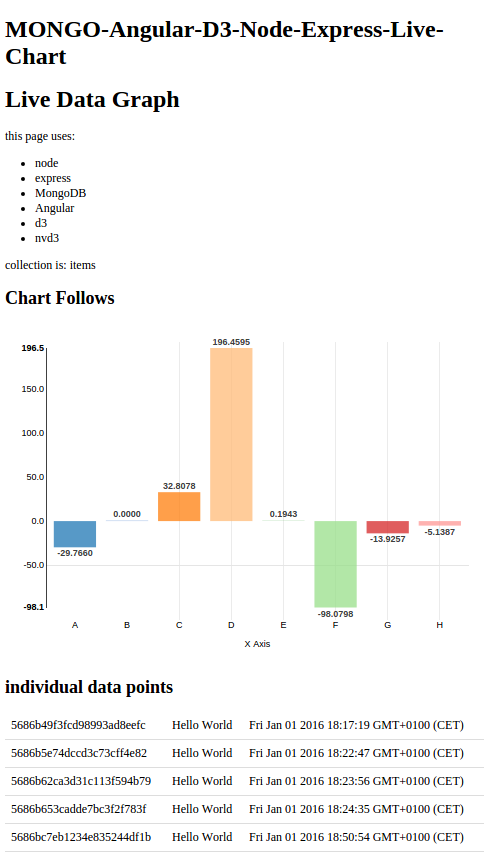

# angular-d3-node-mongo-live-website

A site which has real-time graphs and doubles as mobile chart backend.

<p align="center">
  
</p>


# Technologies

* node.js
* express.js
* express-handlebars.js -- my favorite view engine
* mongodb
* angular.js
* d3.js
* nvd3.js -- live charts based on d3 and angular.js


# Interface for `get-ting` and `post-ing` stuff


#### example cli polling of data:

`curl -H "Accept: application/json"  "http://localhost:3000/items/"`

example stdout:

```sh
[{"_id":"5689996069a8129d33198c85","value":"74"}]
```

#### example of posting data:

optionally can use curl or the wrapped version of this `./server_script.sh` in a loop:

```sh
curl -H "Content-Type: application/json" -X POST -d '{"value":"42"}' http://localhost:3000/items
```
#### example cli get all:

`curl -H "Accept: application/json"  "http://localhost:3000/items/getall"`


#### updating/replacing a value

replace `{das_id}` with the unique id for the entry you need to replace (see `example cli get all` entry right above)

```sh
curl -H "Content-Type: application/json" -X PUT -d '{"value":"180"}' http://localhost:3000/items/{das_id}
```

# Notes

#### keeping `./bower_components` directory in `./public`

These technologies have an active communities of developers/maintainers; 

#### Installing MongoDB on Ubuntu 15

Ubuntu 15 has some added hurdles for getting MongoDB >2.6.3 versions to work, so turns you will need to revert to 2.6.3 (this is queued to be fixed in Ubuntu in 16.04).

If you installed a >2.6.3 version and need to revert, try reinstalling mongodb with apt-get -- this worked for me:

`sudo apt-get install --reinstall mongodb`


#### Express no longer bundled `body-parser`, etc...

At time of writing, the vast majority of tutorials out there have `express.bodyParser(` lines -- however as of recently body-parser need be installed and called separately, see index.js for the fix.

#### express-handlebars (no longer express3-handlebars)

update your require lines : )

Btw, while I prefer the handlebars view-engine over jade, if you would rather use jade see the tutorial linked in the next section.

# Thanks

A lot of thanks to Michael Katz's for this awesome tutorial -- really helped for how to set up a node-express app with mongo:

http://www.raywenderlich.com/61078/write-simple-node-jsmongodb-web-service-ios-app
